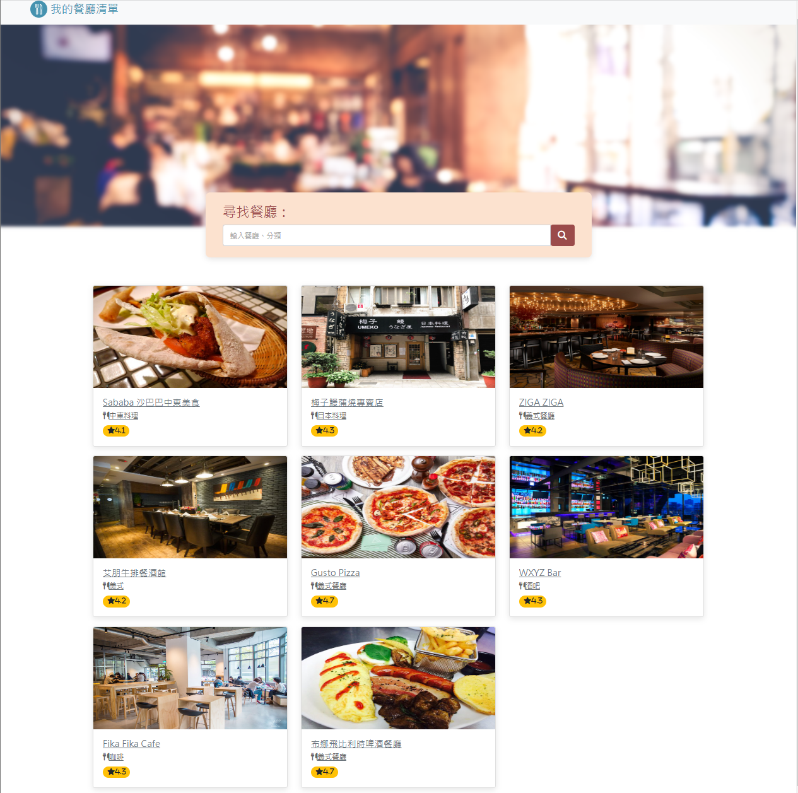
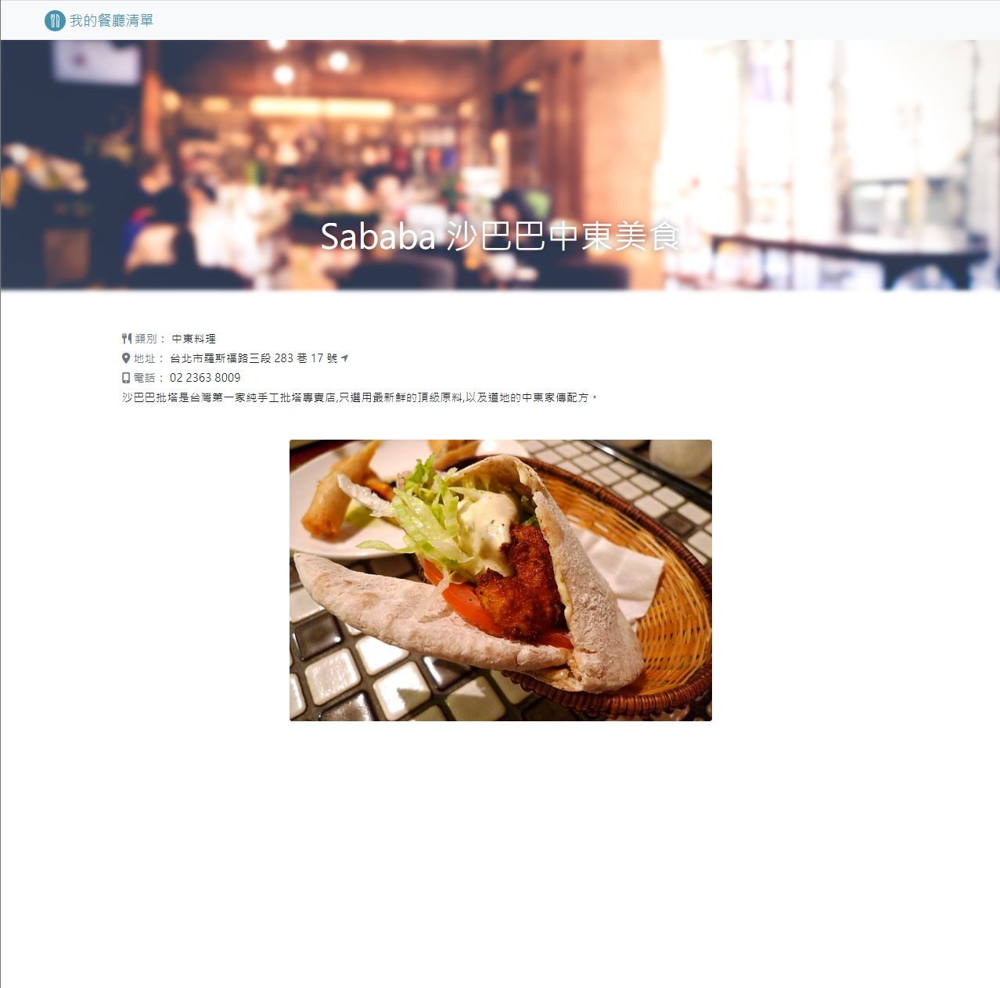

# Restaurant List
A simple web application for restaurant fanatic




## Features

- listing restaurant from restaurant api
- searching restaurant by name
- searching restaurant by category
- showing restaurant detail when you click it

## How to use 

1. please confirm you have already installed node.js and npm first
2. clone this repository to your computer
3. use the terminal to access the folder , and then type the command below

   ```bash
   npm install
   ```

4. after the installation complete , keep typing

   ```bash
   npm run start
   ```

5. if you see this message means the server is on, you can use that URL to go into the website

   ```bash
   Express is listening on http://localhost:3000
   ```  

6. if you want to stop it, use command below

   ```bash
   ctrl + c
   ```

## Code style
[](https://standardjs.com)

## Tech/framework used


